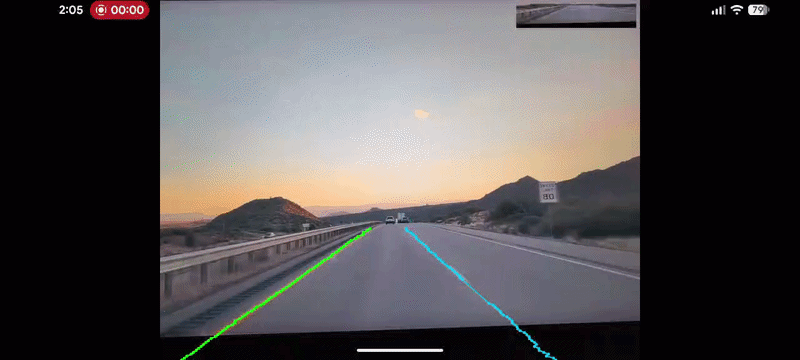

# DRGNFlyEngine

Lane detection that runs on your phone, in real time, with nothing sent to a server.

Point the camera at a road and the app finds the lane lines and draws them over the live
preview. Everything happens in native C++ on the phone's GPU, at roughly 20 frames per
second on a Pixel 9 Pro XL.



*About this demo: the phone is filming a monitor playing dashcam footage, not looking out
of a car window. That makes the job much harder than it looks. A screen is flat, so there
is no real depth or horizon. Colours and brightness are flattened by the display. And the
camera sensor picks up interference patterns from the monitor's own pixel grid that were
never part of the original scene. So take this as proof that the whole pipeline runs in
real time, not as a measure of how accurate the detection is.*

## Status

Working prototype. It tracks the lane you are driving in reliably on marked highway.
The lanes further out are still being tuned. See [Known limitations](#known-limitations).

## How it works

Each camera frame goes through this:

```
CameraX gives us a 1920x1440 RGBA frame
  -> handed to C++ over JNI with no copying
  -> OpenCV crops the bottom 40%, resizes to 1600x320, drops the alpha channel
  -> pixels normalized in one pass with a lookup table
  -> LiteRT runs the model on the GPU
  -> the model's output is decoded into lane points
  -> points are drawn as lines on a transparent overlay
```

Two details keep this fast. The camera frame arrives as a direct `ByteBuffer`, so the
pixels are never copied when crossing from Java into C++. And preprocessing writes its
results straight into the model's input tensor, using an OpenCV `Mat` that points at that
memory, so there is no temporary image sitting in between.

### The model

[Ultra Fast Lane Detection v2](https://github.com/cfzd/Ultra-Fast-Lane-Detection-v2) with
a ResNet-18 backbone, trained on the CULane dataset. It was converted to TFLite with
dynamic-range quantization, which means the weights are stored as 8-bit integers while
the maths still runs in floating point.

It takes one image and produces four outputs:

| tensor | shape | what it is |
| --- | --- | --- |
| input | `1 x 320 x 1600 x 3` | the normalized RGB image |
| `loc_col` | `1 x 100 x 81 x 4` | where each lane sits, measured column by column |
| `exist_col` | `1 x 2 x 81 x 4` | whether the lane is actually there, column by column |
| `loc_row` | `1 x 200 x 72 x 4` | where each lane sits, measured row by row |
| `exist_row` | `1 x 2 x 72 x 4` | whether the lane is actually there, row by row |

That last number, 4, is the lane index. The model always reports four lanes, ordered left
to right from the driver's point of view.

### Why there are two sets of outputs

The model describes every lane twice, and the two descriptions are good at different things.

The row version answers "at this height in the image, how far across is the lane?" That is
an easy question for a line running roughly up and down the screen, like the lane markings
either side of you. It is a terrible question for a line running roughly flat across the
screen, because a flat line crosses a whole row at once and there is no single answer.

The column version asks the same thing the other way round: "at this position across the
image, how high up is the lane?" That works well for the flat lines and badly for the
upright ones.

So the decoder picks whichever fits:

- **Your own two lane lines** use the row outputs. They run roughly up and down the screen.
- **The lanes beyond those** use the column outputs. They sweep off toward the sides of the
  frame at shallow angles.

Getting this backwards is what makes the outer lanes come out as jagged scribbles.

To place a point precisely, the decoder does not just take the model's best guess cell. It
takes a weighted average across that cell and its two neighbours, which lands the point
between cells instead of snapping to one.

There are also two checks that throw away bad detections. A lane has to show up at more
than half of its measurement points before it gets drawn at all. And individual points
where the model is clearly unsure get dropped.

### The anchor mapping trap

If you ever port UFLDv2 yourself, this is the part that will catch you out.

The model measures lanes at 72 fixed heights. Those heights are described as covering the
bottom 58% of the image, from 42% down to the bottom. But that is 42% of the **original
photo**, and the model is not fed the original photo. It is fed the bottom 60% of it.

Work it through and those 72 measurement points actually spread across almost the entire
input image, from row 11 to row 320. If you assume they cover the bottom 58% of the input,
every lane you draw gets squashed into the lower half of the frame and sits in the wrong
place.

## Performance

Measured on a Pixel 9 Pro XL (Tensor G4, Mali-G715).

| stage | time |
| --- | --- |
| preparing the image | 2 to 5 ms |
| running the model | 45 ms |
| decoding and drawing | 3 ms |
| **total per frame** | **50 to 60 ms** |

Every one of the model's 57 operations runs on the GPU, with no handing work back to the
CPU partway through. Running the same model on the CPU takes 137 to 210 ms, so the GPU is
about three to four times faster.

To switch back to the CPU, set `kUseGpu` to `false` in `native-lib.cpp`.

## Requirements

- Android 15 (API 35) or newer
- An arm64 device
- A GPU whose OpenCL driver apps are allowed to use

That last point deserves a warning, because it cost me a while to work out.

Since Android 12, an app has to declare any system library it wants to load, even when
that library is sitting right there on the device and is on the approved list. Miss the
declaration and the OpenCL driver simply refuses to open, with an error message that makes
it sound like the driver is missing entirely. These two lines in the manifest are what fix
it:

```xml
<uses-native-library android:name="libOpenCL.so" android:required="false" />
<uses-native-library android:name="libOpenCL-pixel.so" android:required="false" />
```

Setting `required="false"` means the app still installs on phones that have no OpenCL at
all. Those phones just fall back to the CPU.

## Building

The model file is stored with Git LFS, so set that up before you clone:

```bash
git lfs install
git clone <repo-url>
```

Then open it in Android Studio, or from the command line:

```bash
./gradlew installDebug
```

The first build is slow because CMake downloads and builds OpenCV. After that it is quick.

### What it depends on

| component | version | where it comes from |
| --- | --- | --- |
| LiteRT C++ SDK | 2.1.6 | checked into `app/litert_cc_sdk/` |
| `libLiteRt.so`, `libLiteRtClGlAccelerator.so` | 2.1.6 | prebuilt, in `app/src/main/jniLibs/arm64-v8a/` |
| OpenCV | Android SDK | downloaded by CMake during configure |
| CameraX | 1.6.0 | Gradle |
| CMake | 3.22.1 | Android SDK |

LiteRT is used as a prebuilt library rather than built from source. Building TensorFlow
Lite for Android yourself means cross-compiling `flatc` first, which is slow and breaks
easily. Using the prebuilt version took the native build from minutes down to seconds.

One thing that is easy to waste time on: none of the LiteRT packages include a `prefab`
folder, so `find_package(litert)` will not find anything. The headers come from the copy
in this repo and the libraries from `jniLibs/`.

## Layout

```
app/src/main/
  cpp/native-lib.cpp          the engine: setup, preprocessing, inference, decode, drawing
  cpp/CMakeLists.txt          pulls in OpenCV, wires up LiteRT
  java/.../MainActivity.java  camera setup and drawing the overlay on screen
  jniLibs/arm64-v8a/          prebuilt LiteRT libraries
  assets/                     the model file (Git LFS)
app/litert_cc_sdk/            LiteRT C++ headers and CMake glue
```

## Known limitations

**The image gets squashed.** The model wants a very wide, short image. CULane's training
images were already wide, so cropping and resizing them barely distorted anything, about
7%. A phone camera is much closer to square, so squeezing it into the same shape flattens
it by 33%. Lane lines reach the model looking about 28% shallower than it expects. Cropping
a taller strip makes this worse rather than better, because the sensor is not wide enough
to match.

**Outer lanes get false positives.** A concrete barrier or the edge of the shoulder can
look enough like a lane marking to fool the model. The thresholds that decide what counts
as a real lane came from CULane and have not been tuned for this camera yet.

**Every frame is judged on its own.** Nothing is carried over between frames, so detections
flicker instead of moving smoothly.

**Inference blocks the camera thread.** The model runs on the same thread that receives
camera frames, so that thread sits idle while it waits.

## Roadmap

**Lane keeping is next.** Right now the detected lines are just something to draw. The plan
is to turn them into actual numbers: where the centre of your lane is, how far off it you
are, and how sharply the road is curving. Those three things are what a lane keeping system
needs, and a lane departure warning comes almost free once you know the offset.

Also planned:

- Smoothing detections between frames, and fitting curves through the points
- Moving inference onto its own thread so the camera thread stays free
- Caching the compiled GPU code to cut the 3 second startup delay
- Full integer quantization, which would let the model run on the Tensor NPU
- A lower-resolution version of the model, which would need about a quarter of the compute

## Acknowledgements

Built with help from [Claude Code](https://claude.com/claude-code), used for debugging,
performance work, and drafting this README.

## License

The UFLDv2 architecture and the CULane weights come with their own licenses.
